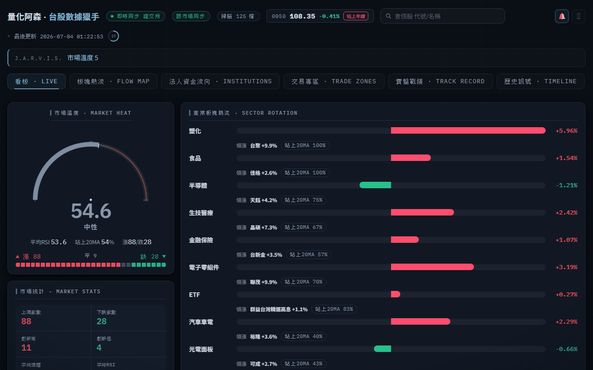

# tw-stock-radar 🎯

[](https://python.org)
[](https://github.com/carsonchou/tw-stock-radar/actions)
[](tests/)
[](LICENSE)
[](#data-sources)
[](#)

**Free Python scanner for all 1,900+ Taiwan stocks — institutional chips, 13 technicals, fundamentals, and AI analyst deep-dives in a dark HUD dashboard.**

No Bloomberg terminal. No paid API. No black box.  
Just Taiwan's own free exchange data, wired together and readable in a browser.

> [繁體中文 README](README.md)

---



---

## Why this exists

Taiwan's institutional data is unusually good and *free*: the TWSE publishes daily net buy/sell for every foreign fund, trust fund, and dealer. TDCC releases weekly ownership distribution across 16 tiers. The exchange posts real-time order books. Nobody pays for this — it's on government open-data portals.

The problem is it's spread across five different API formats, returns in a mix of Traditional Chinese and numeric codes, needs joining with price history, and nobody had assembled it into a single queryable view.

This tool does that assembly: price + chips + fundamentals + AI analysis, all scanned daily across the full market, visible in one dark terminal-style dashboard.

**Honest baseline:** technical signals alone (SuperTrend, etc.) show ~50% winning trades on backtests across the full Taiwan universe — no meaningful edge in isolation. The real value is *information aggregation*: spotting setups where technicals, institutional flow, and retail exit align together. The [Track Record](#track-record) tab shows actual post-signal win rates from live data, not simulated returns.

---

## Screenshots

| Market Radar | Institutional Chips |
|---|---|
|  |  |

| Sector Capital Flow | Track Record |
|---|---|
|  |  |

---

## Features

### 📡 Full-Market Scanner — 1,900+ stocks

Every stock in the TWSE and TPEX universe gets scored **0–100** across four orthogonal dimensions on each scan:

| Dimension | What it measures |
|-----------|-----------------|
| **Trend** | SuperTrend direction, MA20 relationship |
| **Position** | %B (Bollinger position), distance from highs |
| **Momentum** | RSI, MACD histogram, Williams %R, CCI |
| **Volatility** | ATR regime, ADX strength |

Composite score feeds the market temperature gauge (breadth weighted: RSI + MA20 ratio + advance/decline + new high/low + volume).

**Signal detection:** ATR Chandelier stops + TP1 (+1.5R) + TP2 (+4.5R). Confirmed signals push to your phone via [ntfy](https://ntfy.sh) at end of day (deduplicated — one alert per stock per signal side).

**13 indicators per stock:** RSI · MA20 · SuperTrend · MACD · ADX · %B · ATR · OBV · DMI · Williams %R · CCI · Renko candles · custom composite score

---

### 🏦 Chips Module — Taiwan-specific open data

This is what separates the scanner from generic stock tools. Taiwan publicly releases institutional flow data that most markets keep private.

| Source | API | Data |
|--------|-----|------|
| TWSE T86 | `opendata.twse.com.tw` | Foreign funds + trust funds + dealer net buy/sell, consecutive accumulation streak |
| TWSE MI_MARGN | `www.twse.com.tw` | Margin balance change, short interest, short/margin ratio |
| TWSE TWTB4U | `www.twse.com.tw` | Day-trading ratio by stock |
| TDCC QryStockAjax | `www.tdcc.com.tw` | 16-tier retail ownership distribution, weekly change in small holders (1–10 lots) |

Classic setup: retail outflow (TDCC small-holder decrease) + institutional accumulation (T86 consecutive buy streak) + technicals in gear. The chips tab surfaces these confluences in ranked lists.

All three chips endpoints return *full-market* data in a single GET — zero per-stock rate-limiting.

---

### 📊 Dark HUD Dashboard — 5 tabs

Built with vanilla JS + three.js. No framework overhead, no build step.

**Radar tab**
- Market temperature gauge (multi-factor breadth score)
- Animated three.js reactor orb (Iron Man HUD aesthetic)
- Sector heat flow — which industries capital is moving into
- Live signal cards with direction, stop-loss, TP1, TP2
- Advance/decline breadth bar + market-state badge

**Sectors tab**
- Capital flow treemap (area = stock count, color = return)
- Sector breakdown with percentage movers

**Chips Flow tab**
- Foreign fund net buy rankings + consecutive buy streak
- Trust fund accumulation list (Aspirin method)
- Margin hot list + short squeeze candidates
- TDCC retail-exit leaderboard (smart money accumulation signal)

**Track Record tab**
- Real post-signal win rate + average R from live data
- Per-signal scorecard: entry price → actual exit → P&L% → R-multiple
- No backtest inflation — `track.py` uses cached actual prices

**History tab**
- Today's signal timeline with timestamps

---

### 🔍 Deep Stock Page — search any TWSE/TPEX/ETF ticker

Click any stock or type a ticker/name. Loads a full-terminal analysis page:

**Real-time data**
- 5-level order book (TWSE MIS feed, ~20s delay)
- Intraday 1-minute chart (yfinance)
- Price + volume + change + circuit-breaker status

**Health scorecard**
- Continuous A–E grade across 4 dimensions (technicals / chips / fundamentals / valuation)
- Confidence score + key driver callouts
- `health.py` — multi-factor scoring engine, no hard cutoffs

**Price charts**
- Candlestick with MA, daily / weekly / monthly
- All 13 indicators in expandable panels

**Fundamentals**
- EPS: TTM + quarterly trend + YoY growth
- Revenue: YoY% + MoM% with sparkline
- Margins: gross / operating
- Valuation: P/E · P/B · dividend yield · ex-dividend date · ROE (estimated)

**Four AI Teachers** *(requires OpenAI-compatible API key)*

Four named Taiwan trading methodologies applied to the current stock by an LLM, each with a different lens:

| Teacher | Style | Focus |
|---------|-------|-------|
| Zhu Jiahong | Classic technical | Trend confirmation, wave structure |
| Aspirin | Chips-first | Institutional flow, consecutive buy count |
| 權證小哥 | Warrant flow | Leverage entry zones, time decay |
| Zhang Jie | Swing trading | Entry zone, R:R, step-by-step playbook |

Each produces: current position assessment + entry zone + stop level + target + confidence.  
Works with OpenRouter free models (DeepSeek, Qwen) — not just paid OpenAI.

**Additional**
- Google News RSS (per-stock, refreshed on load)
- Watchlist (★) + price alerts (localStorage, intraday push)

---

## Quick Start

**1. Clone and install**
```bash
git clone https://github.com/carsonchou/tw-stock-radar
cd tw-stock-radar
pip install -r requirements.txt
```

**2. Configure (optional)**
```bash
cp .env.example .env
# Edit .env — all keys are optional for core scanner
```

**3. First-run: build price cache** *(~20 min, one time only)*
```bash
python prefill_cache.py
```
Downloads 9 months of daily price history for all 1,925 TWSE + TPEX stocks.  
Sources: twstock → TWSE direct API → yfinance (cascading fallback).  
After this, daily refreshes take seconds.

**4. Launch**
```bash
python app.py
# → http://127.0.0.1:8899/
```

Or on Windows, double-click `app_launch.bat`.

**5. End-of-day full pipeline**
```bash
python eod.py
# chips → fundamentals → scan → push alerts
```

---

## Architecture

```
tw-stock-radar/
│
├─ app.py              Desktop app: background scan loop + HTTP server
├─ server.py           HTTP handler (static files + /api/* routes)
├─ dashboard.html      5-tab dark HUD (vanilla JS + three.js, no build step)
│
├─ scan.py             Core scan engine → state.json
│   ├─ load_full_universe()    All 1,925 TWSE+TPEX stocks (twstock.codes)
│   ├─ analyse_one()           Per-stock: 13 indicators → 4-dimension score → signal
│   ├─ run_once()              Full scan → state.json + ntfy push
│   └─ freshen_cache()         Daily cache refresh (T+0 twstock)
│
├─ indicators.py       Indicator library (MA/RSI/MACD/SuperTrend/BBand +
│                      OBV/DMI/Williams/CCI/Renko/weekly-monthly resample)
│
├─ chips.py            TWSE T86 — institutional net buy/sell + streaks
├─ margin.py           TWSE MI_MARGN + TWTB4U — margin/short/day-trading
├─ tdcc.py             TDCC QryStockAjax — 16-tier ownership distribution
│
├─ fundamentals.py     TWSE BWIBBU_ALL (P/E, P/B, yield) + FinMind (EPS, revenue)
├─ health.py           Continuous A-E health scoring engine
├─ realtime_quote.py   TWSE MIS order book + yfinance 1-min chart
├─ analyst.py          Four AI Teachers (OpenAI-compatible, works with free models)
├─ news.py             Google News RSS per stock
├─ query.py            Unified stock query (ticker/name → full analysis object)
├─ zones.py            Trading zones: day-trade / short-term / trend candidates
│
├─ twse_price.py       Price history: twstock → TWSE STOCK_DAY API → yfinance
├─ prefill_cache.py    One-time bootstrap: parallel fill for all 1,925 stocks
│
├─ track.py            Post-signal win-rate tracker (real prices, not backtest)
├─ calibrate.py        Lightweight backtester (train/test split by odd/even date)
├─ eod.py              End-of-day pipeline: chips → fundamentals → scan → post
│
├─ tests/              ~110 unit tests (stdlib unittest, zero network, < 3s)
└─ requirements.txt    7 dependencies
```

**State flow:**
```
twstock/TWSE API → cache/*.csv → scan.py → state.json → server.py → dashboard.html
         ↑                          ↑
    prefill_cache.py          chips/margin/tdcc → chips data merged into state
```

---

## Data Sources

All free. No account required for core features.

| Source | Endpoint | Data | Updates |
|--------|----------|------|---------|
| twstock | (Python lib) | Daily OHLCV, stock list | T+0 |
| TWSE STOCK_DAY | `www.twse.com.tw/exchangeReport` | Monthly price history per stock | T+0 |
| TWSE T86 | `opendata.twse.com.tw/v1/exchangeReport/MI_INDEX` | Institutional net buy/sell | T+0 post-close |
| TWSE MI_MARGN | `www.twse.com.tw/exchangeReport/MI_MARGN` | Margin + short interest | T+0 post-close |
| TWSE BWIBBU_ALL | `www.twse.com.tw/exchangeReport/BWIBBU_ALL` | P/E, P/B, yield (full market) | Daily |
| TDCC | `www.tdcc.com.tw/smWeb/QryStockAjax.do` | 16-tier ownership distribution | Weekly (Fri) |
| TWSE MIS | `mis.twse.com.tw/stock/api/getStockInfo.asp` | Real-time order book (~20s) | Live |
| yfinance | — | Fundamentals, 1-min intraday | On-demand |
| Google News RSS | `news.google.com/rss/search` | Per-stock news | On-demand |

**Optional (`.env`):**

| Key | Purpose |
|-----|---------|
| `OPENAI_API_KEY` | Four AI Teachers panel (works with OpenRouter free models) |
| `OPENAI_BASE_URL` | Override to use OpenRouter, local Ollama, etc. |
| `FINMIND_TOKEN` | Richer EPS/revenue/dividend data (free tier: 300 req/hr) |
| `NTFY_TOPIC` | Push alerts to phone via ntfy.sh |

---

## Engineering Notes

**Tests**
```bash
python -m unittest discover -s tests/ -v
```
~110 tests, stdlib `unittest` only. No pytest, no mocks, zero network calls. Runs in under 3 seconds anywhere Python runs. CI runs on every push.

**No look-ahead in backtests**  
`calibrate.py` splits train/test by odd/even date index — never by date range — so there's no future-data leakage even with variable bar counts per stock.

**Track record vs backtest**  
`track.py` records actual push timestamps and uses real cached prices to evaluate outcomes. The Track Record tab shows what actually happened after signals fired, not replayed parameters.

**Graceful degradation**  
Chips modules fail open: if TDCC or T86 is unavailable, the scan runs without chips data rather than crashing. Each chips endpoint is fetched once for the full market (not per-stock), so a single failure doesn't cascade.

**Dependency count**  
7 runtime dependencies (yfinance, pandas, numpy, twstock, openai, python-dotenv, requests). No web framework for the server — stdlib `http.server`. No JS bundler — `dashboard.html` is a single self-contained file.

---

## Honest Limitations

| Feature | Status |
|---------|--------|
| Real-time tick data | ✗ TWSE MIS is ~20s snapshots. True tick requires paid broker API. |
| Broker branch breakdown | ✗ TWSE branch reports have CAPTCHA. Would need a paid provider. |
| Backtest edge | ⚠ Technical signals alone are ~50% win rate on the full universe (no free lunch). Value is in chips confluence, not signal-following. |
| TPEX price history | ⚠ TPEX's monthly API is down. Fallback: TWSE direct API (most OTC stocks also list on TWSE format) then yfinance. Coverage is 99%+ of active stocks. |

---

## Contributing

Issues and PRs welcome. The test suite is the source of truth — if tests pass, the PR is likely good.

```bash
# Run tests before submitting
python -m unittest discover -s tests/ -v

# Add a test for new indicators in tests/test_indicators.py
# Add a test for new chips endpoints in tests/test_chips.py
```

Areas where contributions would be most useful:
- Additional free Taiwan data sources (options OI, warrants, institutional sector flow)
- Better TPEX price history fallback
- English translations for the AI teacher prompts in `analyst.py`

---

## License

MIT — use it, fork it, embed it in your own tools.

> This dashboard is for informational purposes only. Not investment advice. Past signal performance does not guarantee future results.
