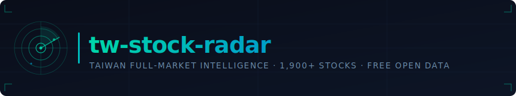
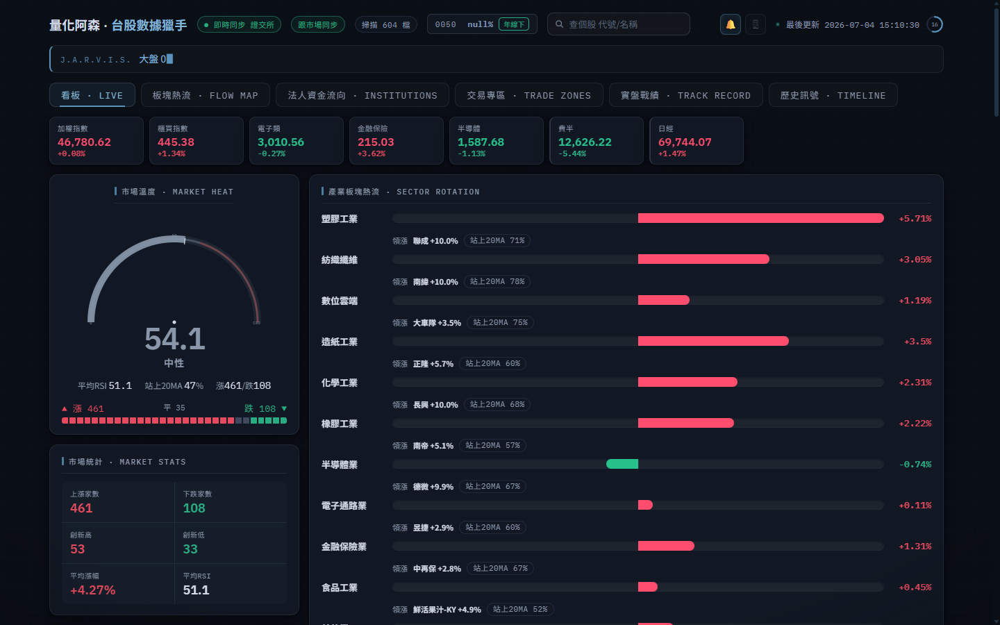
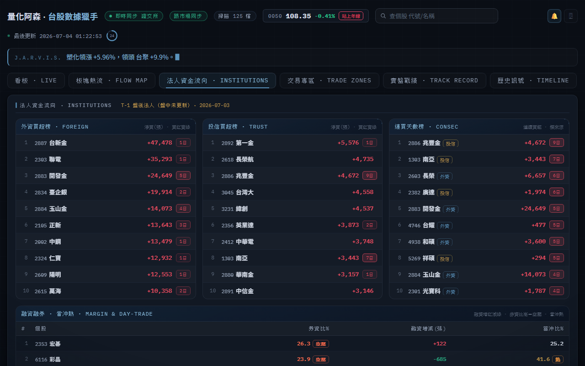
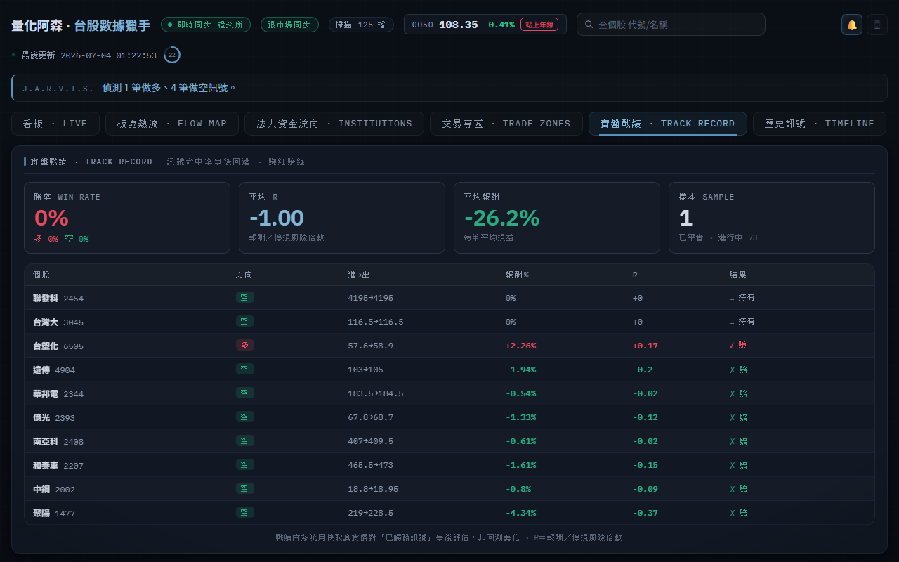
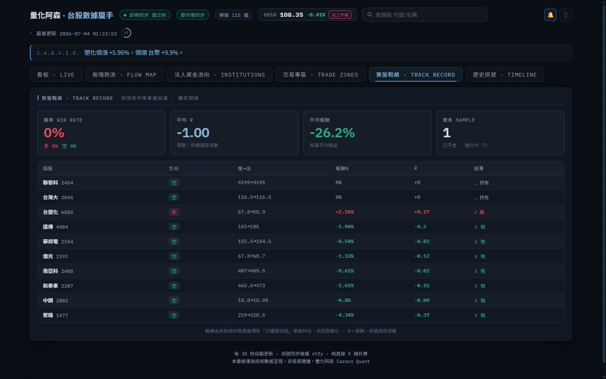

<p align="center">
  
</p>

<p align="center">
  <a href="https://github.com/carsonchou/tw-stock-radar/actions/workflows/test.yml">
    
  </a>
  <a href="https://github.com/carsonchou/tw-stock-radar/releases">
    
  </a>
  <a href="#data-sources">
    
  </a>
  <a href="LICENSE">
    
  </a>
</p>

<p align="center">
  <a href="#quick-start">Quick Start</a> ·
  <a href="#features">Features</a> ·
  <a href="#architecture">Architecture</a> ·
  <a href="#data-sources">Data Sources</a> ·
  <a href="VISION.md">Vision</a> ·
  <a href="#contributing">Contributing</a> ·
  <a href="README.md">繁體中文</a>
</p>

**tw-stock-radar** scans all 1,900+ TWSE + TPEX stocks daily — institutional chips, 13 technicals,
fundamentals, and AI analyst deep-dives in a dark HUD dashboard.
No Bloomberg terminal. No paid API. No black box.

> **New user? Start here: [Quick Start](#quick-start)** — clone → install → prefill → launch.  
> First scan takes ~20 min; daily refreshes are seconds.

---

## Why this exists

Taiwan's institutional data is unusually good — and free.

The TWSE publishes daily net buy/sell for every foreign fund, trust fund, and dealer. TDCC releases
weekly ownership distribution across 16 tiers. The exchange posts real-time order books. Nobody
pays for this; it sits on government open-data portals in half a dozen different formats.

The problem is nobody had assembled it into one queryable view. This tool does that: price + chips +
fundamentals + AI analysis, scanned daily across the full market, visible in one dark terminal-style
dashboard.

**Honest baseline:** technical signals alone show ~50% win rate across the full Taiwan universe —
no free lunch in isolation. The value is multi-source confluence: spotting setups where technicals,
institutional accumulation, and retail exit align at the same time.
The [Track Record](#track-record-tab) tab shows actual post-signal outcomes from live data, not
replayed backtest parameters.

---

## Screenshots

| Market Radar | Institutional Chips |
|:---:|:---:|
|  |  |

| Sector Capital Flow | Signal Track Record |
|:---:|:---:|
|  |  |

---

## Features

### 📡 Full-Market Scanner — 1,900+ stocks <a id="full-market-scanner"></a>

- Scores every stock **0–100** across 4 orthogonal dimensions: trend / position / momentum / volatility
- **13 indicators** per stock: RSI · MA20 · SuperTrend · MACD · ADX · %B · ATR · OBV · DMI · Williams %R · CCI · Renko · composite score
- Detects buy/sell signals with ATR Chandelier stop-loss, TP1 (+1.5R), TP2 (+4.5R)
- Market temperature gauge: RSI breadth + MA20 ratio + advance/decline + new-high/new-low + volume
- End-of-day push alerts via [ntfy](https://ntfy.sh) — deduplicated, one alert per stock per signal side

### 🏦 Chips Module — Taiwan-specific open data <a id="chips-module"></a>

- **TWSE T86** — foreign funds + trust funds + dealer net buy/sell, consecutive accumulation streak
- **TWSE MI_MARGN + TWTB4U** — margin balance change, short interest, short/margin ratio, day-trading ratio
- **TDCC QryStockAjax** — 16-tier retail ownership distribution, weekly change in small holders (1–10 lots)

All three endpoints return full-market data in a single GET — zero per-stock rate-limiting.

Classic setup: retail outflow (TDCC) + institutional accumulation (T86 streak) + technicals in gear.

### 📊 Dark HUD Dashboard — 5 tabs <a id="dashboard"></a>

- **Radar** — temperature gauge, animated three.js reactor orb, sector heat flow, live signal cards with stop/TP
- **Sectors** — capital flow treemap (area = stock count, color = return)
- **Chips Flow** — T86 net buy rankings, trust accumulation list, margin hot list, TDCC retail-exit leaderboard
- **Track Record** — real win rate + average R from live signals (not backtest) <a id="track-record-tab"></a>
- **History** — today's signal timeline

Built with vanilla JS + three.js. No framework, no build step. Single self-contained HTML file.

### 🔍 Deep Stock Page — search any TWSE/TPEX/ETF ticker <a id="deep-stock-page"></a>

- 5-level order book (TWSE MIS, ~20s delay) + intraday 1-min chart
- Health scorecard: A–E grade across 4 dimensions (technicals / chips / fundamentals / valuation)
- Candlestick with MA, daily / weekly / monthly views
- Fundamentals: EPS (TTM + quarterly) · revenue YoY/MoM · gross/operating margins · P/E · P/B · dividend yield · ex-date · ROE
- **Four AI Teachers** (optional API key) — per-stock deep-dive in 4 Taiwan trading methodologies with entry zone + step-by-step playbook
- Google News RSS · watchlist (★) · price alerts — all in localStorage, live refresh

### 🤖 Four AI Teachers <a id="four-ai-teachers"></a>

| Teacher | Style | What it gives you |
|---------|-------|--------------------|
| Zhu Jiahong | Classic technical | Trend confirmation, wave structure, entry trigger |
| Aspirin | Chips-first | Institutional flow, consecutive buy count, accumulation zone |
| 權證小哥 | Warrant flow | Leverage entry zones, time decay, risk exposure |
| Zhang Jie | Swing trading | Entry zone, R:R ratio, step-by-step playbook |

Works with any OpenAI-compatible API — including OpenRouter free models (DeepSeek, Qwen).
Set `OPENAI_API_KEY` + optional `OPENAI_BASE_URL` in `.env`.

---

## Quick Start <a id="quick-start"></a>

**1. Clone and install**
```bash
git clone https://github.com/carsonchou/tw-stock-radar
cd tw-stock-radar
pip install -r requirements.txt
```

**2. Configure** *(all optional — core scanner works with no API keys)*
```bash
cp .env.example .env
# edit .env to add OPENAI_API_KEY (AI teachers) / NTFY_TOPIC (push alerts)
```

**3. First-run: build price cache** *(one time only, ~20 min)*
```bash
python prefill_cache.py
# Downloads 9 months of daily OHLCV for all 1,925 TWSE + TPEX stocks
# twstock → TWSE direct API → yfinance (cascading fallback)
# After this, daily refreshes take seconds
```

**4. Launch**
```bash
python app.py
# → http://127.0.0.1:8899/
```
Windows: double-click `app_launch.bat` instead.

**5. End-of-day full pipeline**
```bash
python eod.py    # chips → fundamentals → scan → push alerts
```

---

## Architecture <a id="architecture"></a>

```
tw-stock-radar/
│
├─ app.py              Desktop app: background scan loop + HTTP server
├─ server.py           HTTP handler (static + /api/* routes)
├─ dashboard.html      5-tab dark HUD (vanilla JS + three.js, no build step)
│
├─ scan.py             Core scan engine → state.json
│   ├─ load_full_universe()   All 1,925 TWSE+TPEX stocks (twstock.codes)
│   ├─ analyse_one()          Per-stock: 13 indicators → 4-dimension score → signal
│   ├─ run_once()             Full scan → state.json + ntfy push
│   └─ freshen_cache()        Daily cache refresh (T+0 twstock)
│
├─ indicators.py       Indicator library (MA/RSI/MACD/SuperTrend/BBand +
│                      OBV/DMI/Williams/CCI/Renko/weekly-monthly resample)
│
├─ chips.py            TWSE T86 — institutional net buy/sell + streaks
├─ margin.py           TWSE MI_MARGN + TWTB4U — margin / short / day-trading
├─ tdcc.py             TDCC QryStockAjax — 16-tier ownership distribution
│
├─ fundamentals.py     TWSE BWIBBU_ALL (P/E, P/B, yield) + FinMind (EPS, revenue)
├─ health.py           Continuous A–E health scoring engine
├─ realtime_quote.py   TWSE MIS order book + yfinance 1-min intraday
├─ analyst.py          Four AI Teachers (OpenAI-compatible)
├─ news.py             Google News RSS per stock
├─ query.py            Unified stock query: ticker/name → full analysis object
├─ zones.py            Trading zones: day-trade / short-term / trend candidates
│
├─ twse_price.py       Price history: twstock → TWSE STOCK_DAY API → yfinance
├─ prefill_cache.py    One-time bootstrap: parallel fill for all 1,925 stocks
│
├─ track.py            Post-signal win-rate tracker (real prices, not backtest)
├─ calibrate.py        Backtester (train/test split by odd/even date, no look-ahead)
├─ eod.py              End-of-day pipeline: chips → fundamentals → scan → alerts
│
├─ tests/              ~110 unit tests (stdlib unittest, zero network, < 3 s)
└─ requirements.txt    7 runtime dependencies
```

**State flow:**
```
twstock / TWSE API
        │
        ▼
  cache/*.csv  ──────────────────────────────────────────────┐
        │                                                     │
        ▼                                                     ▼
     scan.py  ←── chips.py / margin.py / tdcc.py        server.py
        │                                                     │
        ▼                                                     ▼
   state.json  ────────────────────────────────────►  dashboard.html
```

---

## Data Sources <a id="data-sources"></a>

All free. No account required for core features.

| Source | Endpoint | Data | Update cadence |
|--------|----------|------|---------------|
| twstock | Python lib | Daily OHLCV, stock list, industry codes | T+0 |
| TWSE STOCK_DAY | `twse.com.tw/exchangeReport` | Monthly price history per stock | T+0 |
| TWSE T86 | `opendata.twse.com.tw` | Institutional net buy/sell (3 players) | Post-close daily |
| TWSE MI_MARGN | `twse.com.tw/exchangeReport/MI_MARGN` | Margin balance + short interest | Post-close daily |
| TWSE BWIBBU_ALL | `twse.com.tw/exchangeReport/BWIBBU_ALL` | P/E · P/B · yield (full market) | Daily |
| TDCC | `tdcc.com.tw/smWeb/QryStockAjax.do` | 16-tier ownership distribution | Weekly (Friday) |
| TWSE MIS | `mis.twse.com.tw` | Real-time order book (~20s) | Live |
| yfinance | — | Fundamentals, 1-min intraday | On-demand |
| Google News RSS | `news.google.com/rss/search` | Per-stock news | On-demand |

**Optional keys (`.env`):**

| Key | Enables |
|-----|---------|
| `OPENAI_API_KEY` | Four AI Teachers panel |
| `OPENAI_BASE_URL` | OpenRouter / local Ollama / any compatible endpoint |
| `FINMIND_TOKEN` | Richer EPS / revenue / dividend data (free tier: 300 req/hr) |
| `NTFY_TOPIC` | Push alerts to phone via ntfy.sh |

---

## Engineering <a id="engineering"></a>

**Tests**
```bash
python -m unittest discover -s tests/ -v
# ~110 tests · stdlib unittest only · zero network · < 3 seconds
```

CI runs on every push. No pytest, no mocks — if it passes locally it passes in CI.

**No look-ahead in backtests**  
`calibrate.py` splits train/test by odd/even bar index, not by date range — no future data
can leak regardless of uneven bar counts per stock.

**Track record ≠ backtest**  
`track.py` records the actual push timestamp and evaluates outcomes using real cached prices
at T+5 and T+10. The Track Record tab shows what happened after signals fired — not
optimized-in-sample parameters.

**Graceful degradation**  
Chips modules fail open: if TDCC or T86 is unavailable, the scan runs without chips data
rather than crashing. Each chips endpoint is one full-market GET, not per-stock polling.

**Minimal footprint**  
7 runtime dependencies. No web framework for the server (stdlib `http.server`).
No JS bundler (`dashboard.html` is one self-contained file).

---

## Honest Limitations

| Feature | Reality |
|---------|---------|
| Real-time tick | TWSE MIS is ~20s snapshots. True tick requires a paid broker API. |
| Broker branch breakdown | TWSE branch reports have CAPTCHA — fragile to automate. |
| Backtest edge | Technical signals alone: ~50% win rate on the full universe. Value is chips confluence, not signal-following. |
| TPEX price history | Old TPEX monthly endpoint is dead. Fallback: TWSE STOCK_DAY → yfinance. Coverage is 99%+ of active stocks. |

---

## Contributing <a id="contributing"></a>

Issues and PRs welcome. One PR per topic.

```bash
python -m unittest discover -s tests/ -v   # must be green before submitting
```

**Most-wanted contributions:**

- TPEX direct price API — find a working endpoint for OTC stock monthly history
- Options open interest — TWSE publishes OI data free; good signal for warrant traders
- English translations for AI teacher prompts in `analyst.py`
- Additional free Taiwan data sources (warrant flow, institutional sector breakdown)

See [VISION.md](VISION.md) for the full roadmap and what we will not merge.

---

## License

MIT — use it, fork it, embed it.

> For informational purposes only. Not investment advice.  
> Past signal performance does not guarantee future results.
